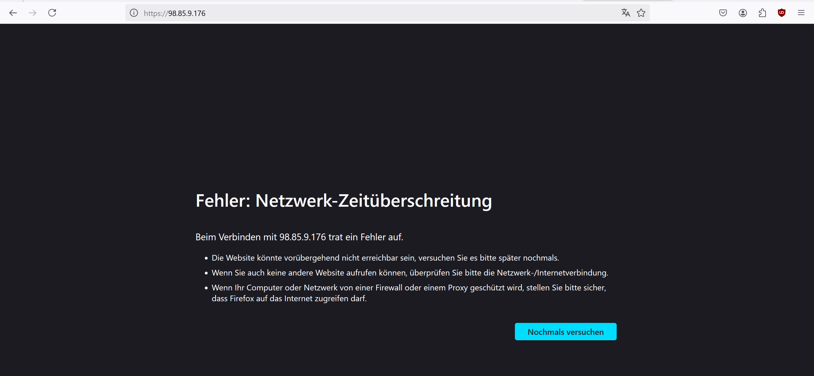

# HTTP & HTTPS Verbindung Test  
Testzeitpunkt:&nbsp;&nbsp;&nbsp;&nbsp;&nbsp;&nbsp;&nbsp;&nbsp;&nbsp;&nbsp;&nbsp;&nbsp;&nbsp;&nbsp;&nbsp;&nbsp;&nbsp;&nbsp;&nbsp;&nbsp;&nbsp;&nbsp;&nbsp;&nbsp;&nbsp;&nbsp;&nbsp;04.12.2024 11:10  
Testperson:&nbsp;&nbsp;&nbsp;&nbsp;&nbsp;&nbsp;&nbsp;&nbsp;&nbsp;&nbsp;&nbsp;&nbsp;&nbsp;&nbsp;&nbsp;&nbsp;&nbsp;&nbsp;&nbsp;&nbsp;&nbsp;&nbsp;&nbsp;&nbsp;&nbsp;&nbsp;&nbsp;&nbsp;&nbsp;&nbsp; Fabian, Bojan und Toni  
Spezielle Informationen:&nbsp;&nbsp;&nbsp;&nbsp;&nbsp;&nbsp;&nbsp;&nbsp;&nbsp;&nbsp;Keine  

Verbindung von externen Laptop auf Website hat funktioniert mit Http und mit Https funktioniert es nicht.
HTTP:  
  
  
HTTPS:  
  
  
Die Website kann nur mit HTTP erreicht werden, was aber nicht so schlimm ist.

> [Zurück zum ReadMe file](README.md)  
> [Weiter zu: Wordpress Verbindung zum Datenbankserver funktioniert](Testfall2.md)
