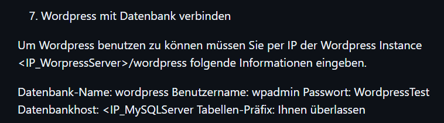

# Wordpress Verbindung zum Datenbankserver funktioniert
Testzeitpunkt:&nbsp;&nbsp;&nbsp;&nbsp;&nbsp;&nbsp;&nbsp;&nbsp;&nbsp;&nbsp;&nbsp;&nbsp;&nbsp;&nbsp;&nbsp;&nbsp;&nbsp;&nbsp;&nbsp;&nbsp;&nbsp;&nbsp;&nbsp;&nbsp;&nbsp;&nbsp;&nbsp;18.12.2024 10:50  
Testperson:&nbsp;&nbsp;&nbsp;&nbsp;&nbsp;&nbsp;&nbsp;&nbsp;&nbsp;&nbsp;&nbsp;&nbsp;&nbsp;&nbsp;&nbsp;&nbsp;&nbsp;&nbsp;&nbsp;&nbsp;&nbsp;&nbsp;&nbsp;&nbsp;&nbsp;&nbsp;&nbsp;&nbsp;&nbsp;&nbsp; Antonio Jon  
Testumgebung:&nbsp;&nbsp;&nbsp;&nbsp;&nbsp;&nbsp;&nbsp;&nbsp;&nbsp;&nbsp;Nach der Installation von WordPress und der MySQL-Datenbank. 
Spezielle Informationen:&nbsp;&nbsp;&nbsp;&nbsp;&nbsp;&nbsp;&nbsp;&nbsp;&nbsp;&nbsp;Die Testumgebung umfasst eine EC2-Instanz mit dem MySQL-Server und eine separate EC2-Instanz mit WordPress. Beide Instanzen befinden sich in derselben Sicherheitsgruppe, um Netzwerkverbindungen zu ermöglichen.  

> [Zurück zum ReadMe file](README.md)  
> [Zurück zu HTTP & HTTPS Verbindung Test](Testfall1.md)
> [Weiter zu:Funktionalität des Skripts install.sh](Testfall3.md)