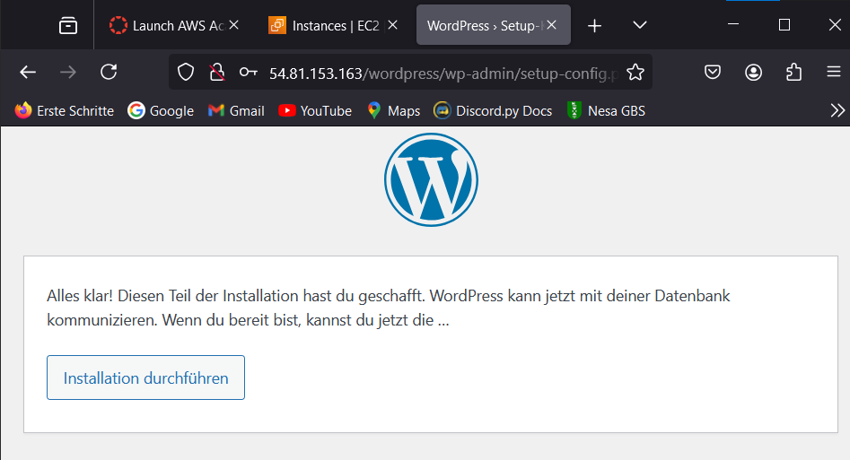
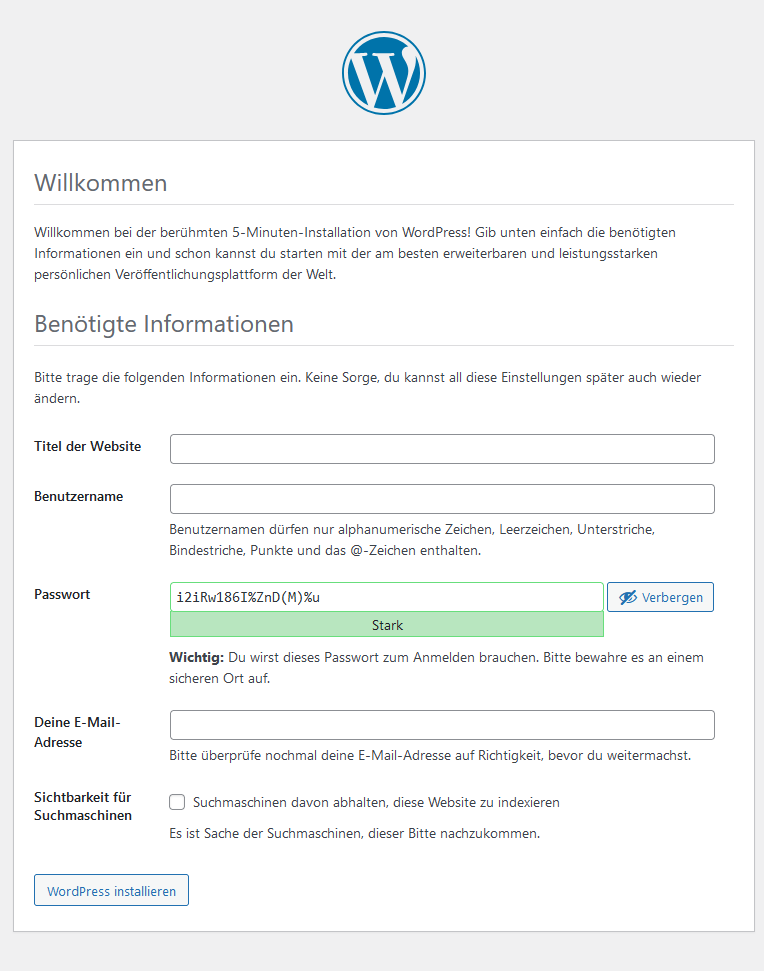

# Wordpress Verbindung zum Datenbankserver funktioniert
- Testzeitpunkt:&nbsp;&nbsp;&nbsp;&nbsp;&nbsp;&nbsp;&nbsp;&nbsp;&nbsp;&nbsp;&nbsp;&nbsp;&nbsp;&nbsp;&nbsp;&nbsp;&nbsp;&nbsp;&nbsp;&nbsp;&nbsp;&nbsp;&nbsp;&nbsp;&nbsp;&nbsp;&nbsp;18.12.2024 15:10  
- Testperson:&nbsp;&nbsp;&nbsp;&nbsp;&nbsp;&nbsp;&nbsp;&nbsp;&nbsp;&nbsp;&nbsp;&nbsp;&nbsp;&nbsp;&nbsp;&nbsp;&nbsp;&nbsp;&nbsp;&nbsp;&nbsp;&nbsp;&nbsp;&nbsp;&nbsp;&nbsp;&nbsp;&nbsp;&nbsp;&nbsp; Antonio Jon  
- Testumgebung:&nbsp;&nbsp;&nbsp;&nbsp;&nbsp;&nbsp;&nbsp;&nbsp;&nbsp;&nbsp;&nbsp;&nbsp;&nbsp;&nbsp;&nbsp;&nbsp;&nbsp;&nbsp;&nbsp;&nbsp;&nbsp;&nbsp;&nbsp;&nbsp;Nach der Installation von WordPress und der MySQL-Datenbank.  
- Spezielle Informationen:&nbsp;&nbsp;&nbsp;&nbsp;&nbsp;&nbsp;&nbsp;&nbsp;&nbsp;&nbsp;Die Testumgebung umfasst eine EC2-Instanz mit dem MySQL-Server und eine separate EC2-Instanz mit WordPress. Beide Instanzen befinden sich in derselben Sicherheitsgruppe, um Netzwerkverbindungen zu ermöglichen.  

Testvorgehen  
1. Verbindung der WordPress-Installation mit der MySQL-Datenbank über die WordPress-Einrichtungsseite.  
2. Eingabe der MySQL-Verbindungsdaten (Datenbankname, Benutzername, Passwort, Host-IP).  
3. Überprüfung, ob WordPress erfolgreich auf die Datenbank zugreifen kann.
Testergebnis
Die Verbindung zwischen WordPress und der MySQL-Datenbank wurde erfolgreich hergestellt.
WordPress konnte die erforderlichen Tabellen in der Datenbank erstellen.
Fazit
Der Test war erfolgreich, die Verbindung funktioniert wie vorgesehen.
Empfehlung: Keine weiteren Maßnahmen erforderlich.

> [Zurück zum ReadMe file](README.md)  
> [Zurück zu HTTP & HTTPS Verbindung Test](Testfall1.md)
> [Weiter zu:Funktionalität des Skripts install.sh](Testfall3.md)
